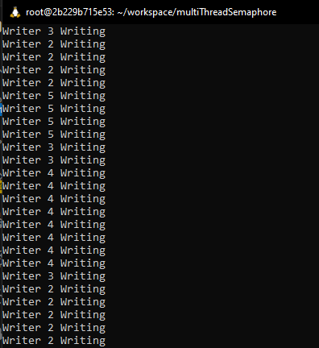
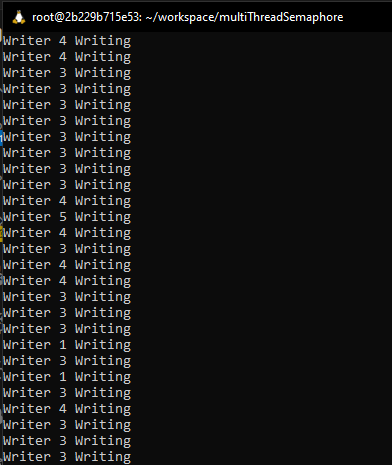
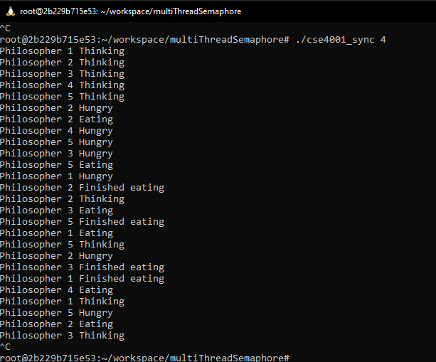

# multiThreadSemaphore

## Solution 1:
.
This is the no starve readers output. I couldn't figure out the issue with only the writer going through.

## Solution 2:
.
This is the Writer priority output. Similarly to solution 1, the writer is the only one getting any time in the output.

## Solution 3:
.
This is the first dining philosophers solution

## Solution 4:
.
I took an hour trying to understand why this problem wouldn't run when my code was showing that it should be working, especially since the boundaries were reset to include 5, but for some reason outputs that it needs to be 1-4. I'm very confused on why this was the case.
